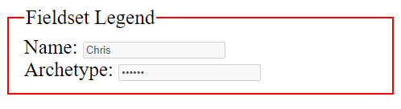

```html
<form action="#">
    <fieldset disabled title="ПОДСКАЗКА">
        <legend>Fieldset Legend</legend>
        <div>
            <label for="name">Name: </label>
            <input type="text" id="name" value="Chris">
        </div>
        <div>
            <label for="pwd">Archetype: </label>
            <input type="password" id="pwd" value="Wookie">
        </div>
    </fieldset>
</form>

<style>
    fieldset {
        border: 2px red solid; /* ширина и цвет обводки */
        font-size: 25px; /* распространяется на все элементы */
    }
</style>
```